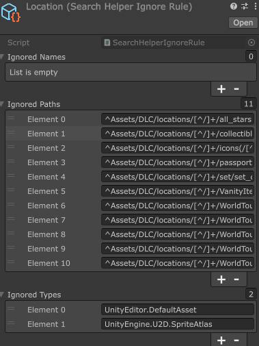

# Search Helper

A lightweight multi-tool for asset management:
- [**Dependency Tool**](README.md#Dependency%20Tool): Maps asset relationships
- [**Used By Tool**](README.md#Used%20By%20Tool): Tracks object references
- [**Unused Tool**](README.md#Unused%20Tool): Identifies orphaned assets
- [**Duplicates Tool**](README.md#Duplicates%20Tool): Finds redundant copies
- [**Merge Tool**](README.md#Merge%20Tool): Consolidates duplicates
- [**Find By GUID Tool**](README.md#Find%20By%20GUID%20Tool): Locates assets by identifier

## Tool Overview

The tool supports displaying unlimited items with comprehensive filtering and sorting functionality.

1. **Available Tools**: Collection of specialized utilities for different tasks.
2. **Settings**: *Note*: Not all tools have configurable settings.
3. **Scan Rules**: 
   1. **Global Mode**: Scans the entire project for dependencies.
   2. **Local Mode**: -> Limited to the specified folder only.
4. **Ignore Rules**: Create `SearchHelperIgnoreRule` ScriptableObjects to exclude specific files from results.
5. **Sorting Rules**: Customize how items are organized in the display.
6. **Filter Rules**: Filter by: Name, Path, Asset Type.
7. **Quick Access Buttons**: One-click actions: Open Folder, Show in Inspector, Search in Scene.
8. **Object Context Menus**: Each object button features a specialized context menu with additional options.
9. **File Information**: Size information where applicable.

### Ignore Rules

You can create custom rule files to exclude specific files from search results. The system uses regex (regular expression) capabilities for matching, allowing you to filter by: 
- **File path**
- **File name**
- **Asset type**

The Samples folder includes example configurations and default rule sets for reference.
The tool automatically detects rule files by type, so you can organize them anywhere in your project structure.

## Tools
### Dependency Tool

The `EditorUtility.CollectDependencies` method is used to compile all dependencies of a given object or an entire folder.
The tool doesn't check for direct script references (aka by filename from a script).

### Used By Tool

The `AssetDatabase.GetDependencies` method is used to a dependency map and tracking object references.
The tool doesn't check for direct script references (aka by filename from a script).

### Unused Tool

Similar to 'Used By', but scans all files within a folder instead of searching for dependencies on the folder itself.

The tool operates in two modes: Local and Global ("Scan Rules")
- **Global Mode**: Scans the entire project for dependencies
- **Local Mode**: Analyzes dependencies only within the specified folder

A common task is to safeguard critical files (for instance, "important") from accidental deletion. This can be automated by setting up a combination of Scan Rules and Ignore Rules, effectively streamlining the cleanup of unused files.

### Duplicates Tool

The tool identifies duplicates by comparing file hashes (MD5) in a folder (defaults to "Assets"). 
The results can be transfered to "Merge Tool" by the button "Open in Merge Tool" or the context menu "Open in Merge Tool".

### Merge Tool

For meta-files, it compares hashes (SHA256) while ignoring the first two lines, with results color-coded in red and green for easy distinction.

***Please note***: This tool is currently under development.The tool is under development now.

### Find By GUID Tool

The tool can locate objects by their GUID or display an object's GUID.
***Please note***: This tool is currently under development.The tool is under development now.