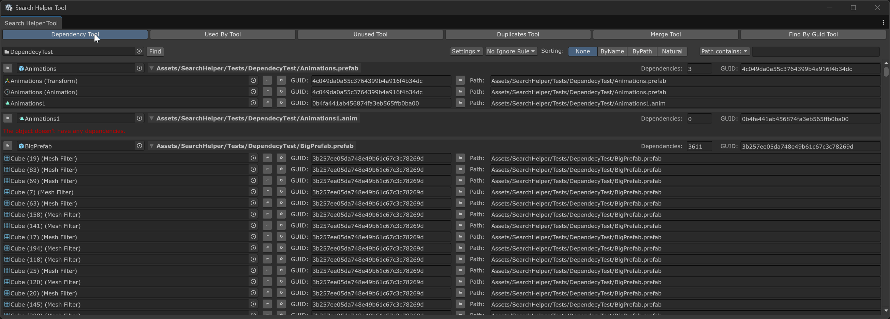
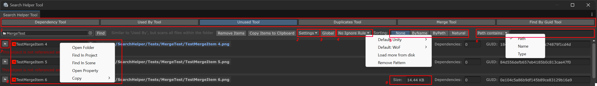
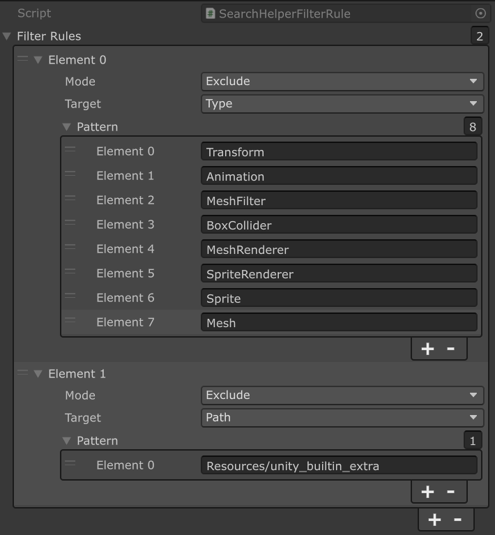
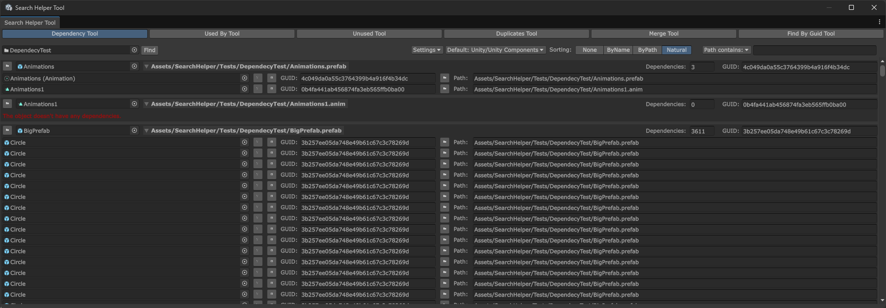
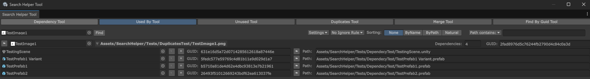
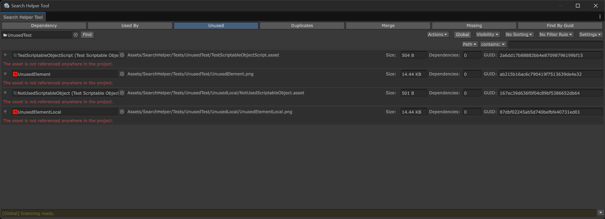
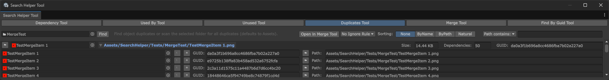
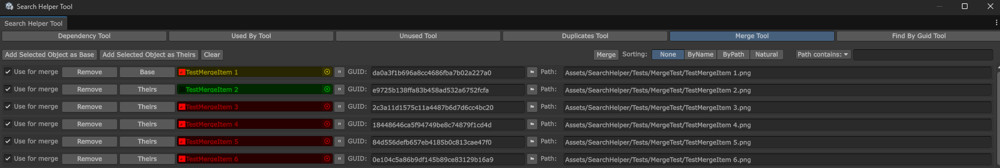
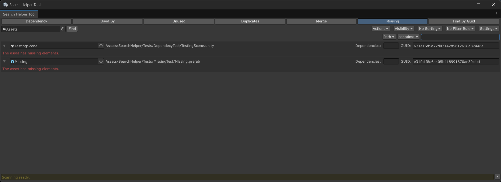
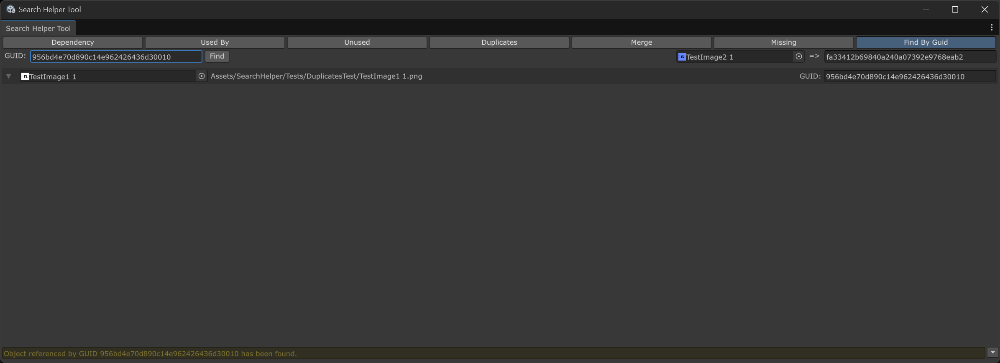

<div align="center">

[](https://www.linkedin.com/in/alexander-yu-shamin/)
&nbsp;
[](https://github.com/alexander-yu-shamin/)
&nbsp;
[](mailto:alexander.yu.shamin@gmail.com)
&nbsp;
[](https://t.me/alexander_yu_shamin)

</div>

<div align="center">

# Search Helper

</div>



A lightweight multi-tool for asset management:
- [**Dependency Tool**](README.md#Dependency%20Tool): Maps asset relationships
- [**Used By Tool**](README.md#Used%20By%20Tool): Tracks object references
- [**Unused Tool**](README.md#Unused%20Tool): Identifies orphaned assets
- [**Duplicates Tool**](README.md#Duplicates%20Tool): Finds redundant copies
- [**Merge Tool**](README.md#Merge%20Tool): Consolidates duplicates
- [**Missing Tool**](README.md#Missing%20Tool): Find missing references
- [**Find By GUID Tool**](README.md#Find%20By%20GUID%20Tool): Locates assets by identifier

## Install

This package depends on several other packages. You must install them in the correct order for everything to work.

Package Manager -> `+` -> Install package from git URL:
- ```
  https://github.com/alexander-yu-shamin/unity-toolkit.git?path=/com.alexander-yu-shamin.toolkit
  ```
- ```
  https://github.com/alexander-yu-shamin/unity-search-helper.git?path=/com.alexander-yu-shamin.search-helper
  ```

or SSH:
- ```
  git@github.com:alexander-yu-shamin/unity-toolkit.git?path=/com.alexander-yu-shamin.toolkit
  ```
- ```
  git@github.com:alexander-yu-shamin/unity-search-helper.git?path=/com.alexander-yu-shamin.search-helper
  ```

## Entrypoints

- Windows -> Search -> Open Search Helper Tool
- The Project Window -> Context Menu -> Search Helper Tool

## Tool Overview



The tool supports displaying unlimited items with comprehensive filtering and sorting functionality.

1. **Available Tools**: Collection of specialized utilities for different tasks.
2. **Actions**: List of actions for every tools
3. **Scan Rules**:
   - **Global Mode**: Scans the entire project for dependencies.
   - **Local Mode**: Limited to the specified folder only.
4. **Visability**: Choose what to show and how
5. **Sorting Rules**: Customize how items are organized in the display.
6. **Filter Rules**: Create `SearchHelperIgnoreRule` ScriptableObjects to exclude specific files from results.
7. **Settings**: *Note*: Not all tools have configurable settings
   - **Use Cache**: When enabled, caching improves search speed — the first launch builds the cache, and subsequent launches use it.
   - **Screen Mode**: Dynamic/Full/Window
8. **Fast filter**: Filter by contains/!contains on: Name, Path, Asset Type
9.  **Contexts**: information found.
10. **Object Context Menus**: Each object button features a specialized context menu with additional options.
11. **Log**: Some information about how the tool works

The tool has 3 display modes:
- Dynamic: change the view by the window size.
- Full: only full screen.
- Window: only window screen.


### Ignore Rules


You can create custom rule files to exclude/include specific files from search results. The system uses regex capabilities for matching, allowing you to filter by:
- **File path**
- **File name**
- **Asset type**

The Samples folder includes example configurations and default rule sets for reference.
The tool automatically detects rule files by type, so you can organize them anywhere in your project structure.

## Tools
### Dependency Tool


The `EditorUtility.CollectDependencies` method is used to compile all dependencies of a given object or an entire folder.
The tool doesn't check for direct script references (aka by filename from a script).

### Used By Tool


The `AssetDatabase.GetDependencies` method is used to build a dependency map and track object references.
The tool doesn't check for direct script references (aka by filename from a script).

**Please note**: Folders are included in the scan as they can be referenced assets in some workflows. To check dependencies for a folder's contents, use the [**Unused Tool**](README.md#Unused%20Tool).

### Unused Tool


Similar to 'Used By', but scans all files within a folder instead of searching for dependencies on the folder itself.

The tool operates in two modes: Local and Global ('Scan Rules')
- **Global Mode**: Scans the entire project for dependencies
- **Local Mode**: Analyzes dependencies only within the specified folder

A common task is to safeguard critical files (for instance, "important") from accidental deletion. This can be automated by setting up a combination of Scan Rules and Ignore Rules, effectively streamlining the cleanup of unused files.

**Important**: The tool operates on principles similar to the [**Used By Tool**](README.md#Used%20By%20Tool). Its Global Scan mode can analyze a folder's contents to show what is referenced. Toggle "Show Used Items" in Settings to invert the display.

### Duplicates Tool


The tool identifies duplicates by comparing file hashes (MD5) in a folder (defaults to "Assets").
The results can be transferred to "Merge Tool" by the button "Open in Merge Tool" or the context menu "Open in Merge Tool".

### Merge Tool


For meta-files, it compares hashes (SHA256) while ignoring the first two lines, with results color-coded for easy distinction.
You should use this tool in Full Screen mode, to see all information.

### Missing Tool


The tool can locate objects with missing references.

### Find By GUID Tool


The tool can locate objects by their GUID or display an object's GUID.